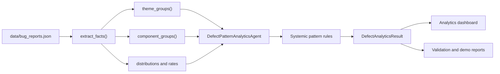
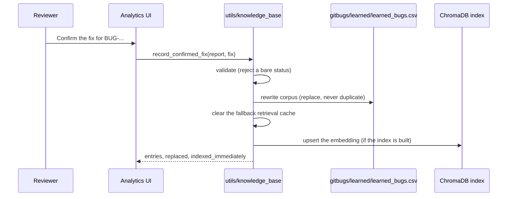

# Milestone 4 — Defect Pattern Analytics, Knowledge Base Growth, and Validation

This document is the technical documentation and project report for Milestone 4.
It covers the two new capabilities, the end-to-end validation that was performed
against them, the defects that validation uncovered, and the demonstration.

| Deliverable | Implementation | Verification |
|---|---|---|
| Defect pattern analytics module | `agents/pattern_analytics_agent.py`, `utils/defect_analytics.py`, `models/analytics_models.py`, `ui/analytics.py` | `tests/test_milestone4_analytics.py` (14 tests) |
| Knowledge base growth mechanism | `utils/knowledge_base.py`, `ui/analytics.py`, `utils/storage.py` | `tests/test_milestone4_knowledge_base.py` (18 tests) |
| End-to-end testing | `evaluation/end_to_end_validation.py` | `tests/test_milestone4_end_to_end.py` (16 tests) |
| Documentation, report, demonstration | this document, `scripts/demo_milestone4.py` | `Documentation/evaluation/milestone4_demo_report.md` |

---

## 1. Defect Pattern Analytics

The five pipeline agents answer questions about **one** defect. The analytics
module answers questions about the **portfolio**: what keeps failing, where it
concentrates, and which problems are systemic rather than isolated.

### Architecture



`utils/defect_analytics.py` holds pure, Streamlit-free aggregation so the same
arithmetic serves the dashboard, the tests, and the generated reports.

### What a "theme" is

A theme is keyed on the pair **(root exception, affected component)** extracted
by the pipeline, not on report text. Two people describe the same failure very
differently; the pair the agents derived for them is directly comparable. So
"Login crashes" and "Cannot sign in at all" both land in
`IllegalStateException in Authentication`.

Submissions with no agent output are **excluded**, not bucketed as
`Unknown/Other`, which would invent a theme that no defect actually has. The
count of excluded submissions is reported in `notes`.

### Systemic pattern rules

All detection is rule-based and traceable — each pattern carries the counts that
triggered it, so a reviewer can check the claim instead of trusting a sentence.
No rule fires below **3 analyzed submissions**, because a proportion over one or
two defects describes an incident, not a system.

| Pattern | Fires when | Meaning |
|---|---|---|
| `recurring-exception:<type>` | one exception ≥ 2 defects and ≥ 25% share | a failure mode, not a series of incidents |
| `component-hotspot:<name>` | one component ≥ 3 defects and ≥ 30% share | a component absorbing disproportionate defects |
| `repeated-failure-point:<loc>` | ≥ 2 defects fail at the same location | the earlier fix addressed a symptom, not the cause |
| `duplicate-influx` | ≥ 30% of defects match a historical duplicate | known defects are being re-reported |
| `knowledge-base-gap` | ≥ 50% of recommendations are not historically grounded | the knowledge base cannot answer what is being asked of it |

`knowledge-base-gap` is deliberately the measurement that Section 2 moves: as
confirmed fixes are fed back, the historically grounded share rises and the
pattern stops firing.

---

## 2. Knowledge Base Growth

A resolved submission whose fix a human has confirmed is the highest-quality
record this system can hold. Unlike a public issue-tracker export — where the
`Resolution` column holds a workflow status such as `Fixed` — it carries a real
description of the corrective action.

### Mechanism



The learned corpus is a CSV under `gitbugs/learned/` on purpose: **both**
retrieval backends already discover dataset files there, so one write makes the
fix retrievable on either path with no special-casing.

- semantic path — `utils.rag_search.load_historical_bugs`
- fallback path — `utils.bug_similarity.load_bug_records`

Column names match the aliases both loaders already understand
(`Issue id`, `Summary`, `Description`, `Root cause`, `Resolution`, `Priority`,
`Status`, `Component`, …).

### Guarantees

- **A status is not a fix.** A confirmed fix shorter than four words is rejected
  with an explanation, so `Fixed` can never become a recommendation.
- **Re-confirming replaces.** A corrected description supersedes the earlier one
  instead of competing with it during retrieval.
- **The write is durable before indexing.** The CSV is written first; a failed
  embedding delays semantic retrieval of the fix but never loses it.
- **No index required.** If the vector index has not been built,
  `indexed_immediately` is `False` and the fix is still retrievable through the
  fallback matcher immediately.

### Measured effect

From `scripts/demo_milestone4.py`, with the knowledge base grown by exactly one
confirmed fix:

| Measure | Before | After |
|---|---|---|
| Remediation basis for the re-reported defect | `diagnostic` | `historical` |
| Duplicates detected | 0 | 1 (`KB-DEMO-001`) |
| Recommendation | generic null-guard advice | the confirmed fix, cited to its source |

---

## 3. End-to-End Testing

`evaluation/end_to_end_validation.py` runs **12 labelled submissions × 4
historical dataset sizes = 48 pipeline runs**, measuring agent accuracy,
duplicate detection quality, and recommendation relevance.

### Coverage

**Bug types:** authentication crash, API payload validation, payment failure,
database exhaustion, upstream dependency timeout, security exposure, storage
exhaustion, cosmetic UI defect, re-reported defect, sparse report, empty
submission, very large log.

**Stack-trace formats:** Java with `Caused by:`, Python traceback, chained
Python traceback, Node.js, Java SQL, key-value log with an embedded trace,
single-line generic error, plain-text submission, prose with no trace, and a
Java trace buried in 20,000 lines of noise.

**Historical dataset sizes:** 0, 6, 30, and 120 records. The empty corpus is
included deliberately — with no history the pipeline must still complete, report
no duplicates, and label its advice `diagnostic` rather than fabricating a
historical basis.

### Method

Duplicate ground truth is **planted**: each case declares which historical
defect is genuinely its duplicate, or `None`. A match to a plausible but
incorrect defect therefore counts as a false positive. A recommendation counts
as relevant only when the remediation agent grounded it in the specific defect
that records the fix (`basis == "historical"` **and** the expected bug id in
`evidence_bug_ids`).

### Results

| Measure | Result |
|---|---:|
| Pipeline completion (5/5 agents) | 100.00% |
| Runs with an agent error | 0 |
| Exception detection accuracy | 100.00% |
| Component classification accuracy | 100.00% |
| Severity classification accuracy | 100.00% |
| Stack-trace parse correctness | 100.00% |
| Duplicate precision | 100.00% |
| Duplicate recall | 85.71% |
| Duplicate F1 | 92.31% |
| Recommendation relevance | 100.00% |
| Average pipeline time | 0.50 s |
| Slowest run (20,000-line log) | 5.93 s |

Duplicate precision and recall are **identical at corpus sizes 6, 30, and 120**:
adding 114 unrelated historical defects produced no false matches, so retrieval
is stable as the knowledge base grows.

Recall is not 100%: three runs miss a true duplicate whose token overlap falls
just under the fallback threshold. This is a recall limit of the token matcher,
not a scoring error — precision stays at 100%, so the system never asserts a
duplicate it cannot support.

### Defects found and fixed by this validation

End-to-end validation was worth running: it exposed four real defects, each now
covered by a regression test.

1. **Exceptions prefixed by a log level or field name were missed.**
   The detector classifies `FATAL: SecurityError: …` and
   `stack: java.io.IOException: …` as Java, and the Java exception pattern is
   line-anchored, so neither exception was found.
   *Fix:* `utils/parser.py` now retries with the unanchored generic scanner
   **only** when the language parser found no exception, so a successful
   language-specific parse is never overridden.
   *Effect:* exception detection 83.33% → 100%.

2. **Plural component keywords were unclassified.**
   "Something is wrong with notifications" classified as `Other` because the
   keyword list held only `notification`.
   *Fix:* `utils/component_classifier.py` accepts the regular plural.
   *Effect:* component accuracy 88.89% → 100%.

3. **A payment outage phrased as a verb triaged as Medium.**
   The severity rules held `payment failure` but not `payment fails`, and
   `all users` but not `all customers`.
   *Fix:* both forms added to `utils/severity_rules.py`.
   *Effect:* severity accuracy 75% → 100%.

4. **Retrieval ignored the stack trace on programmatic submissions.**
   The orchestrator queried `submitted_text or bug_description`. The web form
   always supplies `submitted_text`, but a record assembled programmatically may
   not — so the same defect matched its duplicate when submitted as plain text
   and missed it when its trace lived only in `log_text`.
   *Fix:* `BugAnalysisOrchestrator._retrieval_query` builds the query from every
   available field when `submitted_text` is absent.
   *Effect:* duplicate recall 57.14% → 85.71%, F1 0.727 → 0.923.

Two further defects were found by the demonstration rather than the harness:

5. **The fallback retrieval path discarded `resolution`.**
   `utils/bug_similarity` never carried the resolution or root-cause columns, so
   a confirmed fix could not ground a recommendation until the semantic index
   was rebuilt — which would have made the growth mechanism inert on the default
   path. Both fields now propagate, filtered by the same
   status-versus-resolution rule the indexed path applies.

6. **The first search after a confirmed fix could silently return nothing.**
   Writing a fix cleared the fallback corpus cache, so the next search had to
   reload the whole corpus from disk — which can exceed the 2.5-second
   interactive retrieval budget, returning no matches exactly when the reviewer
   expects to see their new fix. The corpus is now rebuilt at confirmation time,
   where the user has just asked for work to happen, instead of being left cold.

### Reproduction

```bash
python evaluation/end_to_end_validation.py
```

Artifacts: `Documentation/evaluation/milestone4_e2e_validation.md`,
`evaluation/milestone4_e2e_report.json`.

### Limitations

Retrieval in the harness uses a deterministic token matcher over a synthetic
corpus so the run is offline and reproducible; absolute duplicate scores differ
from a semantic-index deployment. The labelled expectations were authored
alongside the agent rules, so these figures characterise deterministic
in-distribution behaviour and are **not** an estimate of accuracy on arbitrary
production reports.

---

## 4. Demonstration

```bash
python scripts/demo_milestone4.py
```

Five distinct submissions run through the complete pipeline, followed by the
growth and analytics demonstrations. The transcript is written to
`Documentation/evaluation/milestone4_demo_report.md`. The demo does not touch
`data/bug_reports.json`; undo its knowledge base write with
`python scripts/demo_milestone4.py --cleanup`.

| Demo | Defect | Format | Result |
|---|---|---|---|
| DEMO-001 | Login crash, production outage | Java trace with `Caused by:` | Critical / P0 / Authentication, `IllegalStateException` |
| DEMO-002 | Order API 500 on missing field | Python traceback | REST API, `KeyError` |
| DEMO-003 | Checkout payment failure | Node.js trace | Critical / P0 / Payment, `TypeError` |
| DEMO-004 | Connection pool exhaustion | Java SQL trace | Database, `SQLException` |
| DEMO-005 | Sign-in failure, re-reported | Java trace | duplicate of DEMO-001 after growth |

The demonstration then confirms the DEMO-001 fix, re-analyzes DEMO-005 to show
`diagnostic → historical`, and prints the analytics across all five.

---

## 5. Running everything

```bash
python -m pytest -q
```

```bash
python evaluation/evaluate_agents.py
```

```bash
python evaluation/end_to_end_validation.py
```

```bash
python scripts/demo_milestone4.py
```

The full suite is **124 tests**. The Milestone 2 agent evaluation still reports
100% on all four fields, confirming that the fixes above introduced no
regression.
