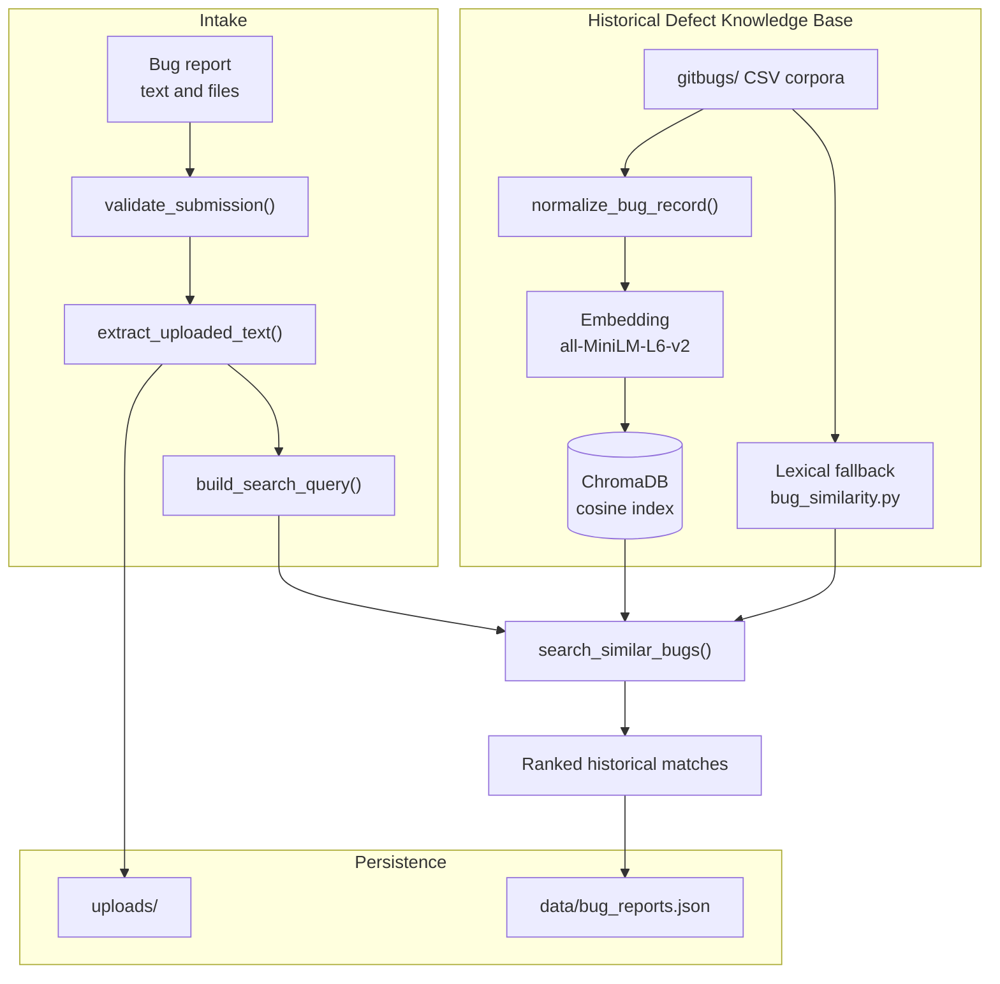
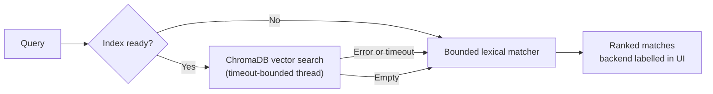

# Milestone 1 — Foundation, Bug Submission, and Historical Knowledge Base

**AI Smart Bug Analyzer & Fix Advisor** · Infosys Springboard Internship
**Period:** 30 June – 9 July · **Status:** Complete

> Part of the [Project Milestone Report](../PROJECT_MILESTONES.md).

---

## 1. Objectives

1. Study defect analysis workflows, Retrieval-Augmented Generation (RAG), semantic similarity, and AI agent orchestration.
2. Design the overall system architecture, agent responsibilities, orchestration flow, and historical defect knowledge base.
3. Develop the Bug Submission Module supporting bug reports, stack traces, logs, and file uploads.
4. Build the Historical Defect Knowledge Base using public datasets, document chunking, embedding generation, and vector indexing.

---

## 2. Research Findings

The research phase produced three architectural commitments that shaped every
later milestone.

| Decision | Rationale |
|---|---|
| **Semantic retrieval over keyword search** | Two reports of the same defect frequently share no vocabulary. "Login crashes" and "Cannot sign in at all" are lexically disjoint but semantically identical; only embedding-based comparison matches them. |
| **Single-responsibility, fault-isolated agents** | A monolithic analyser fails as a unit. Independent agents mean a failure costs one section of the report, not the whole analysis. |
| **Fully offline operation, no generative LLM** | Removes API cost, latency, and network dependency — and eliminates the hallucination surface. A defect-triage tool that invents a plausible cause is worse than one that reports low confidence. |

### Why RAG rather than a fine-tuned model

Historical defect corpora are heterogeneous, project-specific, and continuously
growing. Fine-tuning would require retraining on every new defect. Retrieval
lets the knowledge base grow by **adding a row**, which is exactly what
Milestone 4's growth mechanism does — a design consequence decided here.

---

## 3. System Architecture

### Agent responsibilities (designed here, built in Milestones 2–3)

| Agent | Question it answers | Milestone |
|---|---|---|
| Log Analysis | *What broke, and where?* | 2 |
| Triage | *How urgent is it, and whose is it?* | 2 |
| Root Cause | *Why did it happen?* | 3 |
| Duplicate Detection | *Have we seen this before?* | 3 |
| Remediation | *How do we fix it?* | 3 |
| Pattern Analytics | *What keeps failing across the portfolio?* | 4 |

---

## 4. Implementation Details

### 4.1 Bug Submission Module

Three submission modes with validation rules that adapt to the selection:

| Mode | Requires title + description | Requires file |
|---|---|---|
| `Text` | Yes | No |
| `File` | No | Yes |
| `Text + File` | Yes | Yes |

The mode control sits **outside** the Streamlit form so changing it triggers a
rerun and immediately updates which fields are shown — inside the form, the
conditional fields would not refresh until submission.

Fifteen upload formats are supported, each routed to a dedicated extractor:

| Format | Handling |
|---|---|
| `.txt` `.log` `.java` `.py` `.js` `.ts` `.cpp` `.xml` | Direct UTF-8 decode with replacement for invalid bytes |
| `.json` | Flattened so stack traces stored as escaped strings regain real line breaks |
| `.pdf` | `pypdf`, page text joined |
| `.docx` | `python-docx`, paragraph text joined |
| `.zip` | Text members expanded under strict limits |
| `.png` `.jpg` `.jpeg` | Recorded as an attachment reference |

**The JSON case is worth noting.** A trace stored inside a JSON string carries
`\n` as two literal characters, so the line-anchored parsers cannot see a single
frame. Decoding the structure and emitting multi-line values on their own lines
means an uploaded JSON log is analysed as accurately as a raw `.log` file.

### 4.2 Storage

Filenames are sanitised to `[A-Za-z0-9._-]` before any write, so `../../../etc/passwd`
becomes `.._.._.._etc_passwd` — a flat name inside the upload directory, with
traversal structurally impossible rather than merely checked for. Files are
routed by type (`logs/`, `documents/`, `screenshots/`) and collisions resolved
by numeric suffix so re-uploading a filename never overwrites earlier evidence.

### 4.3 Historical Defect Knowledge Base

The committed corpus is **3,600 defects** — 400 sampled from each of nine
open-source issue trackers:

| Project | Rows | Project | Rows | Project | Rows |
|---|---:|---|---:|---|---:|
| Cassandra | 400 | HBase | 400 | SeaMonkey | 400 |
| Firefox | 400 | Mozilla Core | 400 | Spark | 400 |
| Hadoop | 400 | VS Code | 400 | Thunderbird | 400 |

The full source datasets (~491 MB) are excluded from version control; the
sample is regenerated reproducibly with `scripts/build_sample_corpus.py`.

**Schema normalisation.** Nine trackers name the same concept differently, so a
field-alias table maps roughly 50 column spellings onto 11 canonical fields
(`bug_id`, `title`, `description`, `stack_trace`, `error_log`, `resolution`,
`root_cause`, `priority`, `status`, `labels`, `project_name`). A tenth dataset
requires no new code.

> **A deliberate exclusion.** The `Resolved` column is a *timestamp* in the
> GitBugs exports, not a description of the corrective action. It is explicitly
> absent from the resolution aliases so a date can never be presented as a fix.

**Chunking and embedding.** Each defect is normalised into a single searchable
document joining title, description, stack trace, error log, root cause,
resolution, labels, and project — one coherent unit of meaning per record, with
metadata fields capped at 4,000 characters. Records are embedded in batches of
128 with `all-MiniLM-L6-v2` (384 dimensions, normalised) and **upserted** into
ChromaDB, so an interrupted build resumes without duplicate-ID collisions.

A marker file is written **only** on successful completion, letting the app
distinguish "indexed" from "partially indexed" without opening the database.

### 4.4 Retrieval with graceful degradation

Every path is bounded by a timeout and every result states which backend
produced it. The application is usable before the index is built, and says so.

---

## 5. Modules Developed

| Module | File | Purpose |
|---|---|---|
| Submission page | `pages/bug_submission.py` | Form, uploads, results rendering |
| Validation | `utils/validators.py` | Mode-aware required-field rules |
| Storage | `utils/storage.py` | Sanitisation, routing, collision-safe writes, JSON persistence |
| Retrieval and corpus | `utils/rag_search.py` | Normalisation, embedding, indexing, search, extraction |
| Lexical fallback | `utils/bug_similarity.py` | Dependency-free retrieval |
| Helpers | `utils/helpers.py` | CSS loading, size formatting |
| Logging | `utils/logging_config.py` | Structured JSON logging |
| Index builder | `scripts/build_index.py` | One-time corpus indexing |
| Corpus sampler | `scripts/build_sample_corpus.py` | Reproducible 3,600-row sample |

---

## 6. Technologies Used

| Technology | Version | Role |
|---|---|---|
| Python | 3.11 | Runtime |
| Streamlit | 1.46 | Web interface |
| ChromaDB | 1.5 | Persistent vector index |
| Sentence-Transformers | 5.6 | `all-MiniLM-L6-v2` embeddings |
| pandas / openpyxl | 2.2 / 3.1 | CSV, JSON, JSONL, XLS, XLSX loading |
| pypdf / python-docx / Pillow | 6.x / 1.2 / 11 | Document and image handling |
| Pytest | 9.1 | Testing |

---

## 7. Testing Performed

| Area | Coverage |
|---|---|
| Storage | Round-trip persistence, corrupt-JSON tolerance, ID sequencing, type routing, collision handling, traversal containment |
| Validation | All three modes plus legacy callers omitting `submission_method`; whitespace-only fields rejected |
| Extraction | Every supported format, plus corrupt PDF/DOCX, unsupported extensions, and binary content mislabelled as text |
| Unicode | `崩溃 🐛`, `файл.py`, `ошибка` preserved through parse, storage, retrieval, and display |
| Bounds | Empty, whitespace, and `None` inputs return warnings rather than raising |

Verified by `tests/test_storage_and_validation.py` (15 tests),
`tests/test_upload_limits.py` (16), and `tests/test_rag_search.py`.
`utils/storage.py` and `utils/validators.py` are both at **100% coverage**.

---

## 8. Deliverables

- Bug submission interface with three modes and fifteen supported upload formats
- 3,600-defect knowledge base committed to the repository
- Persistent ChromaDB vector index with resumable batch builds
- Bounded lexical fallback ensuring the app is usable before indexing
- Architecture documentation: `system-architecture.md`, `rag-pipeline.md`, `multi-agent-design.md`, `tech-stack.md`
- Dataset documentation: `DATASETS.md`

---

## 9. Challenges

**Inconsistent dataset schemas.** Nine trackers, nine column vocabularies.
Solved with a single alias table rather than per-dataset adapters — new datasets
require no code.

**Startup latency.** Importing pandas and ChromaDB at module load made every
page load wait on the full database stack. Solved by deferring those imports to
first use and checking a marker file for index status instead of opening the
collection.

**Unbounded interactive waits.** A missing embedding model would have blocked
submission on an unbounded model download. Solved with `local_files_only=True`
plus timeout-bounded retrieval, so a search always returns within its budget.

**Traces invisible inside JSON.** Escaped newlines defeated the line-anchored
parsers entirely. Solved by flattening the JSON structure before parsing.

---

## 10. Achievements

- Complete submission → extraction → retrieval → display path working in Milestone 1
- Retrieval degrades in labelled stages rather than failing outright
- Corpus normalisation proven against nine independently formatted real datasets
- Path traversal made structurally impossible rather than filtered
- Foundation deliberately designed for growth — the same loaders that read the
  shipped corpus discover Milestone 4's learned fixes with no special-casing
