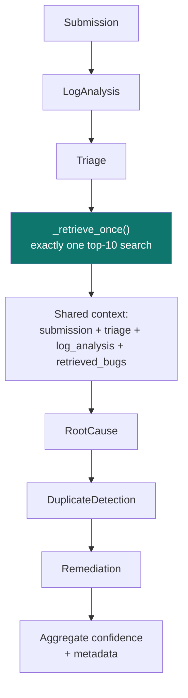

# Milestone 2 — Triage Agent, Log Analysis Agent, and Orchestration

**AI Smart Bug Analyzer & Fix Advisor** · Infosys Springboard Internship
**Period:** 10 – 21 July · **Status:** Complete

> Part of the [Project Milestone Report](../PROJECT_MILESTONES.md).

---

## 1. Objectives

1. Build the Triage Agent to classify bug severity, priority, affected component, and bug category.
2. Develop the Log Analysis Agent to extract exceptions, stack traces, file names, framework details, and execution context.
3. Implement Multi-Agent Orchestration to coordinate all AI agents and manage data flow between modules.
4. Validate analysis accuracy using multiple bug reports and ensure proper communication among agents.

---

## 2. Implementation Details

### 2.1 Log Analysis Agent

The agent parses a log into a typed `LogAnalysisResult` carrying language,
exception type, error message, root exception, file, line, function, module,
package, failure point, and the full call stack.

**Per-language parsing.** Four parsers are dispatched by detected language, each
using line-anchored regular expressions. Anchoring matters: an unanchored
exception pattern quotes ordinary prose back as an exception type.

| Language | Frame pattern | Exception pattern |
|---|---|---|
| Python | `File "…", line N, in func` | `SomeError: message` at line start |
| Java | `at pkg.Class.method(File.java:N)` | `[Caused by:] pkg.SomeException: message` |
| JavaScript / Node | `at func (file.js:N:C)` and bare form | `[Uncaught] TypeError: message` |
| Fallback | — | Generic unanchored `Name(Error\|Exception\|Failure): message` |

**Root-exception semantics differ by language**, and this is handled explicitly
rather than uniformly:

| Language | Which exception is the root | Why |
|---|---|---|
| **Python** | The **last** in a chained traceback | After *"During handling of the above exception"*, the final exception is the one that actually propagated |
| **Java** | The **deepest** `Caused by:` link | The first entry is what surfaced; both are reported so the chain stays visible |

**Failure-frame selection** follows the same asymmetry — Python prints the
innermost call **last**, Java and JavaScript print it **first**. Choosing the
wrong end names the entry point instead of the failing code:

```python
@staticmethod
def _failure_frame(parsed: Any) -> dict[str, Any]:
    if not parsed.frames:
        return {}
    return parsed.frames[-1] if parsed.language == "Python" else parsed.frames[0]
```

**Embedded-exception recovery.** Real logs prefix lines with a level or field
name (`FATAL: SecurityError: signed URL validation bypassed`), which defeats
line anchoring. A generic unanchored scanner runs **only when the language
parser found nothing at all**, so a successful parse is never overridden by a
weaker match.

**Bounds.** Logs are truncated to the most recent 1,000,000 characters and call
stacks capped at 200 frames, with both stated in the result's `warnings`.

### 2.2 Triage Agent

Produces a typed `TriageResult`: severity, priority, component, business impact,
confidence, reasoning, and evidence.

**Severity** is scored from weighted rule tables over the combined report text,
with **negation guards** applied first — phrases such as "no data loss occurred"
are neutralised so they cannot score as data loss.

**Priority derives from severity plus impact context**, not from severity alone.
P0 is reserved for a Critical defect that is *also* production-breaking or
customer-facing. The practical consequence is visible in the sample uploads:

| Input | Triage | Why |
|---|---|---|
| `java_nullpointer.log` alone | Medium / P2 | A raw stack trace states no user impact |
| The same trace + *"production outage, all users unable to log in"* | Critical / P0 | Impact is now stated |

This is the agent behaving correctly, not inconsistently — severity follows
stated impact rather than exception type.

> **Scale deviation, documented deliberately.** Priority uses **P0–P3** rather
> than the P1–P4 scale named in the brief. The rules make a real distinction at
> the top of the scale (production-breaking vs. merely critical), and a fourth
> "someday" band would never be assigned by any rule. Recorded in
> `models/triage_models.py`.

**Confidence** is derived from counted signals, never assumed. When no text is
present, confidence is forced to 5% — the agent reports uncertainty rather than
defaulting high on empty input.

### 2.3 Multi-Agent Orchestration



Three properties defined here carry through the whole project:

**Fault isolation.** Every agent runs inside a guarded `_execute` boundary. A
failure is caught, recorded in `metadata.agent_errors` as `"TypeError: …"`, and
logged with a full traceback — the remaining agents continue. One failing agent
costs one section of the report.

**Exactly one retrieval, shared.** `_retrieve_once` performs a single top-10
search and passes that same evidence set to Root Cause, Duplicate Detection, and
Remediation. This keeps the three agents mutually consistent — they cannot cite
contradictory histories — and holds the pipeline to one retrieval cost. When the
submission already carries `similar_bugs` from the web form, it is reused and
flagged `retrieval_reused`.

**Ordered execution.** Log Analysis and Triage run first because they need no
history. Retrieval follows. The three evidence-grounded agents run last.

**Confidence aggregation** averages agent confidence percentages only. Duplicate
similarity is excluded deliberately: it measures how alike two defects are, a
different unit from how certain an agent is. Absence of a result is never
treated as certainty.

---

## 3. Modules Developed

| Module | File | Purpose |
|---|---|---|
| Triage agent | `agents/triage_agent.py` | Severity, priority, component, impact, confidence |
| Log analysis agent | `agents/log_analysis_agent.py` | Exception, frames, failure point, language |
| Stack-trace parsers | `utils/parser.py` | Bounded multi-language parsing |
| Severity rules | `utils/severity_rules.py` | Weighted scoring with negation guards |
| Component classifier | `utils/component_classifier.py` | Component inference with match strength |
| Language detector | `utils/language_detector.py` | Language identification |
| Confidence scoring | `utils/scoring.py`, `utils/confidence.py` | Signal-based bounded confidence |
| Orchestrator | `agents/orchestrator.py` | Fault-isolated coordination |
| Triage contracts | `models/triage_models.py` | `TriageResult` |
| Log contracts | `models/log_models.py` | `LogAnalysisResult`, `StackFrame` |

---

## 4. Technologies Used

| Technology | Role |
|---|---|
| Pydantic 2.11 | Typed, validated agent contracts with field constraints (`confidence: int = Field(ge=0, le=100)`) |
| Python `re` | Line-anchored, bounded stack-trace parsing |
| `dataclasses` with `slots=True` | Low-overhead intermediate parse results |
| Structured JSON logging | Per-agent logs with `submission_id` and confidence |
| Pytest | Unit and evaluation testing |

Typed contracts matter for orchestration: an agent returning a malformed result
fails at its own boundary and is caught, rather than corrupting downstream
agents with an unexpected shape.

---

## 5. Testing Performed

### 5.1 Evaluation harness

`evaluation/evaluate_agents.py` over a 60-report labelled set:

| Measure | Result |
|---|---:|
| Dataset size | 60 |
| Severity accuracy | 100% |
| Priority accuracy | 100% |
| Component accuracy | 100% |
| Exception detection accuracy | 100% |
| All-fields exact match | 100% |
| Average triage confidence | 84.5% |
| Average log analysis confidence | 80.4% |
| Average execution time | 0.097 s |
| P95 execution time | 0.092 s |
| False positives | 0 |
| False negatives | 0 |

> **How to read these numbers.** The labels are derived from the same rule
> tables the agents use to predict them, so this harness measures
> **self-consistency and regression safety, not generalisation to unseen
> defects**. It reliably catches a rule change that breaks existing behaviour.
> The independent accuracy measurement is the Milestone 4 end-to-end validation,
> which uses hand-labelled expectations. Presenting 100% as an accuracy claim
> would misrepresent the methodology.

### 5.2 Unit testing

| Suite | Tests | Focus |
|---|---:|---|
| `tests/test_triage.py` | 12 | Severity, priority, component, negation guards |
| `tests/test_log_analysis.py` | 8 | Per-language parsing, chains, failure points |
| `tests/test_orchestrator.py` | 3 | Pipeline execution and output shape |
| `tests/test_app_entrypoint.py` | 4 | Entry point and module wiring |

### 5.3 Edge cases verified

Empty, whitespace-only, and `None` logs return a warning rather than raising;
5 MB traces cap at 200 frames; nested Java `Caused by:` chains resolve to the
deepest link; mixed-language logs pick one parser deterministically; null bytes
and full Unicode parse without error; unknown exception types are still
extracted by the fallback.

### 5.4 Inter-agent communication

Verified that exactly one retrieval is performed and shared, that downstream
agents receive upstream output through the shared context, and that an induced
agent failure is captured in `metadata.agent_errors` while the remaining agents
complete normally.

---

## 6. Deliverables

- Triage and Log Analysis agents with typed Pydantic contracts
- Fault-isolated orchestrator with structured error metadata and shared retrieval
- 60-report evaluation harness producing CSV, JSON, and Markdown reports
- Validation write-up: `Documentation/evaluation/triage_log_analysis_validation.md`
- Structured JSON logging across all agents

---

## 7. Challenges

**Prose misread as exceptions.** Unanchored regular expressions quoted ordinary
sentences back as exception types. Solved by anchoring per-language patterns to
line start, then adding the guarded recovery pass for the legitimate case of a
prefixed exception line.

**Cross-language root-cause semantics.** "Root exception" means the *last*
exception in Python and the *deepest* `Caused by:` in Java, and the failure
frame sits at opposite ends of the trace. A uniform implementation is wrong for
at least one language. Solved with explicit per-language handling, documented at
each site.

**Confidence honesty.** Early scoring returned high confidence on near-empty
input, which is the most damaging possible failure for a triage tool. Solved by
deriving confidence from counted signals and forcing 5% when no text is present.

**Priority scale mismatch.** The brief's P1–P4 scale did not match the
distinction the rules actually make. Resolved by adopting P0–P3 and documenting
the deviation in the model rather than silently implementing an unused band.

---

## 8. Achievements

- Zero false positives and zero false negatives across the 60-report evaluation set
- Sub-100 ms average agent execution (P95 0.092 s)
- Fault isolation proven under induced failure — pipeline continues with structured error metadata
- Correct root-exception resolution across three language families with differing conventions
- Severity demonstrably responsive to stated impact, not just exception type
- The orchestration contract established here — one shared retrieval, guarded
  boundaries, typed outputs — supported three more agents in Milestone 3 and a
  portfolio analytics layer in Milestone 4 without structural change
