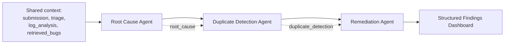

# Milestone 3 — Root Cause, Duplicate Detection, Remediation, and Structured Findings

**AI Smart Bug Analyzer & Fix Advisor** · Infosys Springboard Internship
**Period:** 22 – 31 July · **Status:** Complete

> Part of the [Project Milestone Report](../PROJECT_MILESTONES.md).

---

## 1. Objectives

1. Build the Root Cause Agent using RAG retrieval to generate probable root cause hypotheses with confidence scores and supporting evidence.
2. Develop the Duplicate Detection Agent using semantic similarity search over historical defects to identify previously resolved issues.
3. Build the Remediation Agent to generate fix recommendations based on historical resolutions, retrieved evidence, and software engineering best practices.
4. Develop the Structured Findings Display showing severity, extracted logs, root cause, duplicate matches, confidence scores, and recommended fixes.

---

## 2. Implementation Details

This milestone completes the five-agent pipeline. All three agents added here
are **evidence-grounded** — they consume the single shared retrieval context
established in Milestone 2 rather than searching independently, so they cannot
cite contradictory histories.



### 2.1 Root Cause Agent

Produces a `RootCauseResult` with hypothesis, confidence, reasoning, ranked
`EvidenceItem` list, and matched bug IDs. Each evidence item carries its source,
bug ID, detail, and similarity percentage — so a reviewer can open the cited
defect and check the claim rather than trusting the output.

When retrieval yields nothing usable, the agent falls back to exception-family
reasoning at **visibly reduced confidence** rather than asserting a cause. The
demonstration shows this working as intended: on a corpus containing no
comparable defect, root-cause confidence lands at 21–27%. The agent is stating
that it is inferring from the exception type alone, which is the honest answer.

### 2.2 Duplicate Detection Agent

Returns ranked `DuplicateMatch` records, each carrying bug ID, similarity,
status, summary, resolution, and the reasons it matched.

**The threshold is deliberately conservative.** A false duplicate sends an
engineer to an unrelated defect and wastes the time the tool exists to save; a
missed duplicate merely leaves them where they started. The asymmetry justifies
trading recall for precision, and the measured behaviour reflects the choice:

| Measure | Result |
|---|---:|
| Precision | **100.00%** |
| Recall | 85.71% |
| F1 | 92.31% |

Duplicates below threshold are excluded entirely rather than shown with a
caveat — a low-confidence duplicate in the interface still invites the engineer
to chase it.

### 2.3 Remediation Agent

Generates a recommendation, the supporting historical resolution, a best
practice, ordered remediation steps, and confidence. Its defining property is
**provenance labelling**:

| Basis | Condition | Confidence |
|---|---|---|
| `historical` | A retrieved defect carries genuinely descriptive fix text | Higher |
| `diagnostic` | No usable historical resolution; recommendation derives from exception-family best practice | Capped lower |

The interface always states which applies. The engineer knows whether they are
reading a fix someone actually applied or an inference from the exception type.

#### The workflow-status filter

This required a filter that a naive implementation would omit. Issue trackers
record a one-word workflow **outcome** in the Resolution column:

```
Resolution: Fixed
Resolution: WontFix
Resolution: WorksForMe
```

That states a defect was **closed**, not how it was **repaired**. Surfacing
"Fixed" as a recommended remedy would be the single most misleading output the
system could produce — it looks like an answer and contains nothing.

`split_resolution()` rejects any value matching a known workflow status, and any
text under four words, returning it as `resolution_status` instead of
`resolution`. The filter is applied **identically on both retrieval paths**, so
the semantic and fallback backends cannot disagree about what counts as a fix.

The consequence is visible and correct: against the GitBugs corpus — which
records statuses rather than fix text — all five demonstration submissions
produce `diagnostic` recommendations. The system reports having no historical
fix rather than inventing one.

### 2.4 Structured Findings Display

A tabbed dashboard rendering the complete analysis:

| Element | Content |
|---|---|
| **Summary cards** | Severity, priority, component, overall confidence |
| **Log analysis** | Exception, failure point, language, confidence, full call-stack table |
| **Root cause** | Hypothesis, reasoning, ranked evidence table with similarity |
| **Duplicates** | Ranked match cards with bug ID, similarity badge, status, resolution |
| **Remediation** | Recommendation, provenance label, historical fix, best practice, ordered steps |
| **Timeline** | Per-agent execution with processing time and any errors |
| **Downloads** | Full structured report export |

All dynamic values are HTML-escaped before injection. Similarity badges are
colour-banded (high ≥ 90%, medium ≥ 75%, low below), and match reasons are shown
so a similarity score is never presented without explanation.

---

## 3. Modules Developed

| Module | File | Purpose |
|---|---|---|
| Root cause agent | `agents/root_cause_agent.py` | Grounded hypothesis with ranked evidence |
| Duplicate agent | `agents/duplicate_agent.py` | Threshold-filtered ranked duplicates |
| Remediation agent | `agents/remediation_agent.py` | Provenance-labelled fixes and ordered steps |
| Findings dashboard | `ui/findings.py` | Tabbed structured display |
| Analysis contracts | `models/analysis_models.py` | `EvidenceItem`, `RootCauseResult`, `DuplicateMatch`, `DuplicateResult`, `RemediationResult` |
| Resolution filter | `utils/rag_search.py` — `split_resolution()` | Separates descriptive fixes from workflow statuses |

---

## 4. Technologies Used

| Technology | Role |
|---|---|
| ChromaDB | Cosine-similarity retrieval over the historical index |
| Sentence-Transformers | `all-MiniLM-L6-v2` query and corpus embeddings |
| Pydantic 2.11 | Typed evidence and result contracts with bounded score fields |
| Streamlit | Tabs, metrics, expanders, dataframes, custom-styled result cards |

---

## 5. Testing Performed

| Suite | Tests | Focus |
|---|---:|---|
| `tests/test_milestone3_agents.py` | 11 | All three agents across grounded and ungrounded paths |
| `tests/test_milestone3_orchestrator.py` | 6 | Context sharing, ordering, fault isolation |
| `tests/test_findings.py` | 4 | Dashboard rendering with partial and complete analyses |
| `tests/test_review_fixes.py` | 26 | Regression coverage including resolution filtering |

**Behaviours explicitly verified:**

- A workflow status (`Fixed`, `WontFix`) never surfaces as a resolution on either retrieval path
- Resolution text under four words is rejected as non-descriptive
- Duplicates below threshold are excluded, not merely de-emphasised
- Every evidence bug ID traces to an actually retrieved record
- All three agents degrade to labelled low confidence on empty retrieval rather than asserting
- Remediation basis is always present and correct for the evidence available
- The dashboard renders correctly when an agent produced no output

---

## 6. Deliverables

- Three evidence-grounded agents completing the five-agent pipeline
- Provenance labelling distinguishing cited fixes from inferred ones
- Workflow-status filter preventing meaningless recommendations
- Tabbed structured findings dashboard with downloadable reports
- Design documentation: `multi-agent-design.md`

---

## 7. Challenges

**Workflow statuses masquerading as fixes.** The corpus is full of
`Resolution: Fixed`. Presenting that as a recommendation would have looked like
a working feature while being actively useless. Solved with `split_resolution()`,
applied identically on both retrieval paths.

**Retrieval query completeness.** A record whose stack trace lived only in
`log_text` retrieved far less than the same defect submitted as prose —
validation measured the *identical* defect matching its duplicate in one form
and missing it in the other. A stack trace carries the identifiers that make a
defect findable. Solved by building the query from every available field, capped
at 20,000 characters.

**Confidence unit mixing.** Averaging duplicate similarity into overall
confidence conflated "how alike are these two defects" with "how sure is this
agent". Excluded explicitly, with the reasoning documented at the aggregation
site.

**Threshold calibration.** Any threshold trades precision against recall. Rather
than optimising F1, the threshold was set from the cost asymmetry — a false
duplicate wastes engineering time, a missed one does not — yielding 100%
precision at 85.71% recall.

---

## 8. Achievements

- Complete five-agent pipeline with every conclusion traceable to a named rule or cited bug ID
- **100% duplicate precision** — no engineer is ever sent to an unrelated defect
- Recommendation provenance always explicit, never implied
- Structured findings dashboard presenting six analysis dimensions with full evidence
- Agents proven to degrade honestly: on a corpus with no comparable defect, all
  five demonstration submissions correctly report `diagnostic` at capped
  confidence rather than fabricating a historical fix
