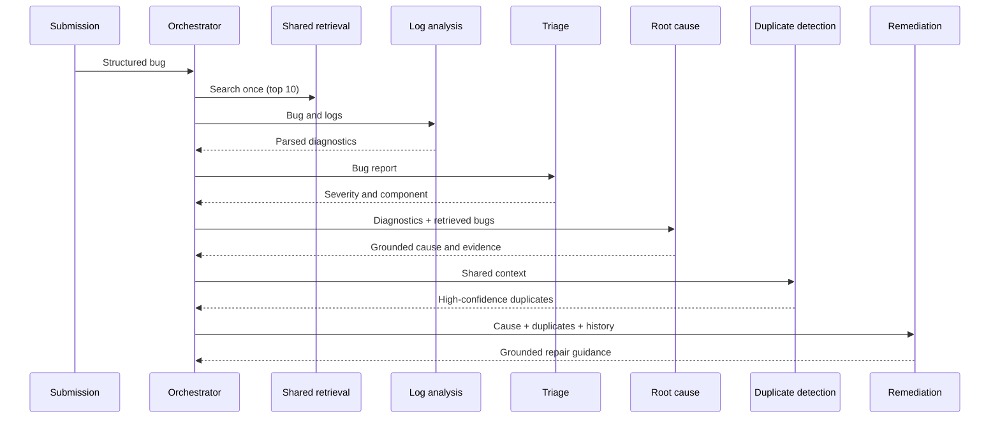

# Multi-Agent Design

## Implemented agents

### Triage agent

The triage agent combines the report fields into a bounded text input and
returns a structured Pydantic result containing severity, priority, likely
component, confidence, evidence, and reasoning signals.

### Log-analysis agent

The log-analysis agent detects the likely language and parses Python, Java,
JavaScript, or generic logs. It returns the exception, message, likely source
location, call-stack frames, confidence, and warnings.

### Root-cause agent

The root-cause agent compares the normalized exception, component, and stack
summary with the shared historical candidates. It prefers recorded root-cause
fields, then recorded resolutions, and only uses the current parser hint when a
retrieved record supports the comparison. Every historical evidence item keeps
its bug ID and similarity score.

### Duplicate-detection agent

The duplicate agent re-ranks the top ten semantic candidates using exception,
component, and severity agreement. Only candidates meeting the configurable
65% confidence threshold are returned, capped at five results.

### Remediation agent

The remediation agent uses recorded resolutions from retrieved or duplicate
bugs. It returns a fix, ordered verification steps, likely stack files,
historical provenance, prevention guidance, and confidence. It never fabricates
a fix when no resolution is present.

## Orchestration

`BugAnalysisOrchestrator` runs agents in this order:

An exception from one stage is recorded under `metadata.agent_errors` and does
not stop later agents. Results use a stable envelope with:

- submission ID and UTC timestamp
- outputs from all five agents and overall confidence
- executed-agent names and errors
- processing duration
- schema version 3.0
- retrieval count/reuse metadata and forward context

An optional injected result store allows persistence without coupling agents to
the Streamlit interface.

New agents must preserve fault isolation, typed schemas, bounded processing,
shared retrieval, and evidence provenance.

## Remediation provenance

Every remediation result carries a `basis` field so a reader can tell where the
recommendation came from:

| Basis | Meaning | Confidence |
|---|---|---|
| `historical` | Taken from the recorded resolution of a retrieved defect | Up to 95 |
| `diagnostic` | Inferred from the current exception and root cause only | Up to 55 |
| `none` | Neither source carried enough signal to recommend anything | Up to 35 |

The historical path is always preferred. The diagnostic path exists because
issue-tracker exports such as GitBugs record a one-word workflow outcome
(`Fixed`, `WontFix`) rather than a description of the repair, so a corpus can
retrieve well-matched defects while containing no fix text at all. A diagnostic
result never claims historical evidence: `evidence_bug_ids` stays empty and the
interface labels it explicitly.
