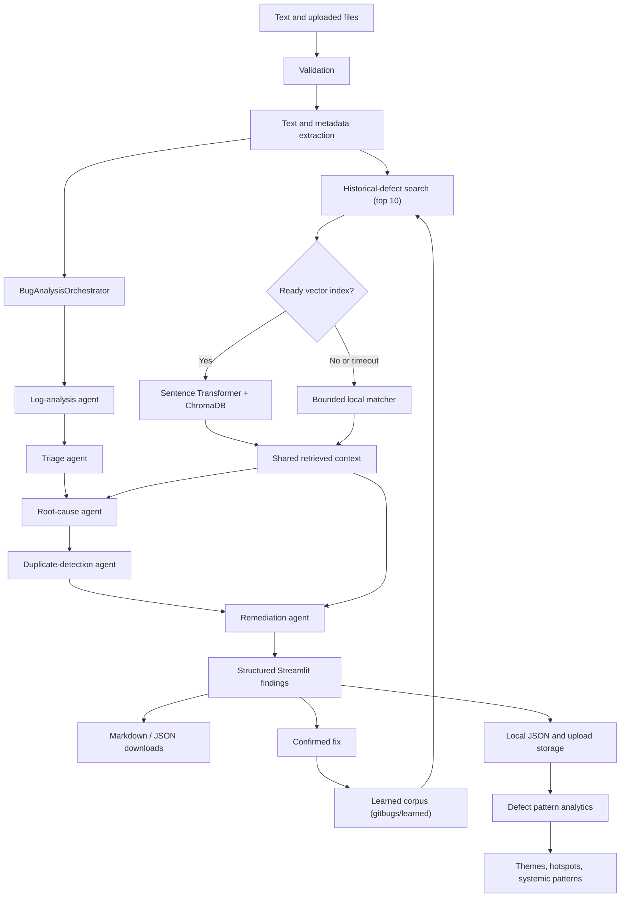

# System Architecture

The application is a local Streamlit system with deterministic analysis and
bounded semantic retrieval.

The two feedback edges are what distinguish Milestone 4 from a one-shot
pipeline: a confirmed fix re-enters retrieval as evidence, and the accumulated
submissions are measured as a portfolio rather than one at a time.

## Design properties

- **Local-first:** no hosted API is required.
- **Fault-isolated:** one agent failure does not discard other results.
- **Bounded:** logs, stack frames, dataset rows, result counts, and vector-search
  time are limited.
- **Structured:** Pydantic models and schema version 3.0 make results testable.
- **Grounded:** causes and fixes retain historical bug IDs and evidence details.
- **Efficient:** retrieval runs once and the results are passed forward.
- **Graceful degradation:** semantic retrieval falls back to local matching.
- **Runtime separation:** reports, uploads, models, and vector indexes are not
  committed to Git.

- **Self-improving:** a confirmed fix is written back to the retrieval corpus,
  so the system answers a repeat failure from a proven fix rather than an
  inference.

The implementation includes all five Milestone 3 agents. When no historical
resolution exists, remediation explicitly declines to invent a code change and
returns evidence-gathering steps with conservative confidence.

The Milestone 4 analytics agent runs outside the per-defect pipeline. It reads
saved submissions, never issues retrieval, and applies rule-based detection with
a minimum sample size, so it can only report patterns the stored evidence
supports.
