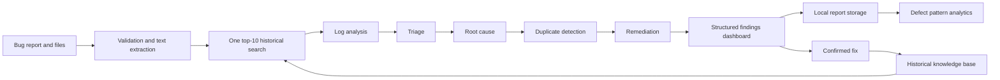

# AI Smart Bug Analyzer and Fix Advisor

A Streamlit application that accepts bug reports and supporting files, runs a
five-agent analysis pipeline, and produces traceable root-cause and remediation
findings grounded in retrieved historical defects.

## Features

- Text, file, or combined bug submission
- Python, Java, JavaScript, and generic log parsing
- Severity, priority, component, and confidence estimation
- Fault-isolated log analysis, triage, root cause, duplicate, and remediation agents
- Semantic retrieval with Sentence Transformers and ChromaDB
- One shared top-10 retrieval reused by every downstream agent
- Weighted confidence from semantic, exception, component, stack, and log signals
- High-confidence duplicate filtering and historical resolution summaries
- Tabbed structured findings dashboard with history and report downloads
- Defect pattern analytics: recurring themes, component hotspots, and rule-based
  systemic issue detection across every analyzed submission
- Knowledge base growth: confirmed fixes are written back and immediately become
  retrievable evidence for future submissions
- Bounded local similarity fallback when the vector index is unavailable
- Support for CSV, JSON, JSONL, XLS, and XLSX knowledge-base files
- Local report and upload persistence
- Evaluation reports and a comprehensive Pytest suite

## Quick start

```powershell
git clone https://github.com/Ragav-K/AI-Smart-Bug-Analyzer-Fix-Advisor.git
cd AI-Smart-Bug-Analyzer-Fix-Advisor
python -m venv .venv
.\.venv\Scripts\Activate.ps1
python -m pip install --upgrade pip
python -m pip install -r requirements.txt
python -m streamlit run streamlit_app.py
```

Open `http://localhost:8501` in a browser.

The application works without an API key, and the historical defect knowledge
base (`gitbugs/samples/`, 3,600 defects) ships with the repository.

For semantic retrieval, build the vector index once. This embeds the 3,600-defect
committed corpus and takes roughly 4–5 minutes:

```powershell
python scripts/build_index.py
```

Until then the app runs on the bounded local token matcher at lower recall, and
says so in the interface. Semantic duplicate detection and historically grounded
recommendations need the index, so build it before a demonstration.

The raw per-project exports under `gitbugs/<project>/` are **not** indexed by
default: they exceed 5 million rows in total, and embedding them is an
hours-long job producing an index of tens of gigabytes. Pass `--full` if you
genuinely want them.

On a cold start the embedding model takes about 25 seconds to load. The app
begins loading it in the background as soon as the page renders, so it is ready
by the time a report is submitted; a warm semantic search takes about 50 ms.

## How it works



## Documentation

| Document | Purpose |
|---|---|
| [**Project milestone report**](Documentation/PROJECT_MILESTONES.md) | **Complete four-milestone report: architecture, implementation, testing, and demonstration** |
| [Milestone 1](Documentation/milestones/MILESTONE_1.md) | Foundation, bug submission, and historical knowledge base |
| [Milestone 2](Documentation/milestones/MILESTONE_2.md) | Triage agent, log analysis agent, and orchestration |
| [Milestone 3](Documentation/milestones/MILESTONE_3.md) | Root cause, duplicate detection, remediation, and findings |
| [Milestone 4 report](Documentation/milestones/MILESTONE_4.md) | Pattern analytics, knowledge base growth, and validation |
| [Installation](Documentation/INSTALLATION.md) | Environment setup and application startup |
| [Usage](Documentation/USAGE.md) | Submission workflow and result interpretation |
| [Project structure](Documentation/PROJECT_STRUCTURE.md) | Repository layout and module responsibilities |
| [System architecture](Documentation/system-architecture.md) | Runtime components and data flow |
| [Multi-agent design](Documentation/multi-agent-design.md) | Agent contracts and fault isolation |
| [Milestone 4](Documentation/MILESTONE4.md) | Defect pattern analytics, knowledge base growth, and end-to-end validation |
| [RAG pipeline](Documentation/rag-pipeline.md) | Historical-defect retrieval behavior |
| [Datasets](Documentation/DATASETS.md) | Dataset formats, storage, and Git policy |
| [Tech stack](Documentation/tech-stack.md) | Technologies actually used by the project |
| [Testing](Documentation/TESTING.md) | Unit tests and evaluation suite |
| [Developer guide](Documentation/DEVELOPER_GUIDE.md) | Agent extension, schemas, and quality workflow |
| [Troubleshooting](Documentation/TROUBLESHOOTING.md) | Common setup and runtime problems |
| [Roadmap](Documentation/ROADMAP.md) | Planned improvements |
| [Security](Documentation/SECURITY.md) | Vulnerability reporting and data-handling notes |
| [Changelog](Documentation/CHANGELOG.md) | Notable project changes |

## Runtime data

The following local artifacts are intentionally excluded from Git:

- `data/bug_reports.json`
- `data/chroma_*/`
- `uploads/`
- full raw files matching `gitbugs/**/*_bugs.csv`

Compact `*-combined.csv` samples are committed for demonstrations and testing.
See [DATASETS.md](Documentation/DATASETS.md) before adding new datasets.

## Tests

```powershell
python -m pytest -q
python -m evaluation.evaluate_agents
```

The suite covers all five agents, retrieval reuse, fault isolation, dashboard
rendering, malformed input, empty evidence, and the existing Milestone 1/2 behavior.

## Privacy and limitations

Reports and uploaded files are stored locally and may contain sensitive data.
Do not submit credentials, access tokens, private customer information, or
production secrets. The analyzer provides diagnostic suggestions, not
guaranteed fixes; recommendations should be reviewed and tested by a developer.

## License

This repository does not currently declare an open-source license. Unless the
owner adds one, normal copyright restrictions apply.
