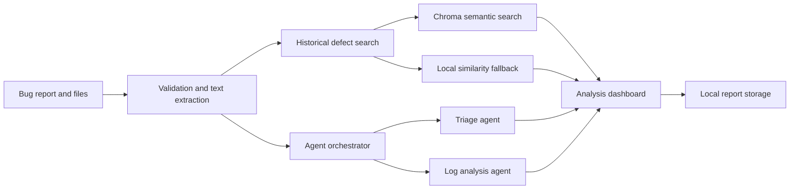

# AI Smart Bug Analyzer and Fix Advisor

A Streamlit application that accepts bug reports and supporting files, performs
rule-based triage and stack-trace analysis, and searches historical defects for
similar issues.

## Features

- Text, file, or combined bug submission
- Python, Java, JavaScript, and generic log parsing
- Severity, priority, component, and confidence estimation
- Fault-isolated triage and log-analysis agents
- Semantic retrieval with Sentence Transformers and ChromaDB
- Bounded local similarity fallback when the vector index is unavailable
- Support for CSV, JSON, JSONL, XLS, and XLSX knowledge-base files
- Local report and upload persistence
- Evaluation reports and a 25-test Pytest suite

## Quick start

```powershell
git clone https://github.com/Ragav-K/AI-Smart-Bug-Analyzer-Fix-Advisor.git
cd AI-Smart-Bug-Analyzer-Fix-Advisor
python -m venv .venv
.\.venv\Scripts\Activate.ps1
python -m pip install --upgrade pip
python -m pip install -r requirements.txt
python -m streamlit run streamlit_app.py
```

Open `http://localhost:8501` in a browser.

The application works without an API key. If the `all-MiniLM-L6-v2` model and
Chroma index are unavailable, similarity search uses the bounded local matcher.

## How it works



## Documentation

| Document | Purpose |
|---|---|
| [Installation](INSTALLATION.md) | Environment setup and application startup |
| [Usage](USAGE.md) | Submission workflow and result interpretation |
| [Project structure](PROJECT_STRUCTURE.md) | Repository layout and module responsibilities |
| [System architecture](system-architecture.md) | Runtime components and data flow |
| [Multi-agent design](multi-agent-design.md) | Agent contracts and fault isolation |
| [RAG pipeline](rag-pipeline.md) | Historical-defect retrieval behavior |
| [Datasets](DATASETS.md) | Dataset formats, storage, and Git policy |
| [Tech stack](tech-stack.md) | Technologies actually used by the project |
| [Testing](TESTING.md) | Unit tests and evaluation suite |
| [Troubleshooting](TROUBLESHOOTING.md) | Common setup and runtime problems |
| [Roadmap](ROADMAP.md) | Planned improvements |
| [Contributing](CONTRIBUTING.md) | Contribution workflow and standards |
| [Security](SECURITY.md) | Vulnerability reporting and data-handling notes |
| [Changelog](CHANGELOG.md) | Notable project changes |
| [Code of Conduct](CODE_OF_CONDUCT.md) | Community expectations |

## Runtime data

The following local artifacts are intentionally excluded from Git:

- `data/bug_reports.json`
- `data/chroma_*/`
- `uploads/`
- full raw files matching `gitbugs/**/*_bugs.csv`

Compact `*-combined.csv` samples are committed for demonstrations and testing.
See [DATASETS.md](DATASETS.md) before adding new datasets.

## Tests

```powershell
python -m pytest -q
python -m evaluation.evaluate_agents
```

At the time of this documentation update, the test suite contains 25 passing
tests.

## Privacy and limitations

Reports and uploaded files are stored locally and may contain sensitive data.
Do not submit credentials, access tokens, private customer information, or
production secrets. The analyzer provides diagnostic suggestions, not
guaranteed fixes; recommendations should be reviewed and tested by a developer.

## License

This repository does not currently declare an open-source license. Unless the
owner adds one, normal copyright restrictions apply.
