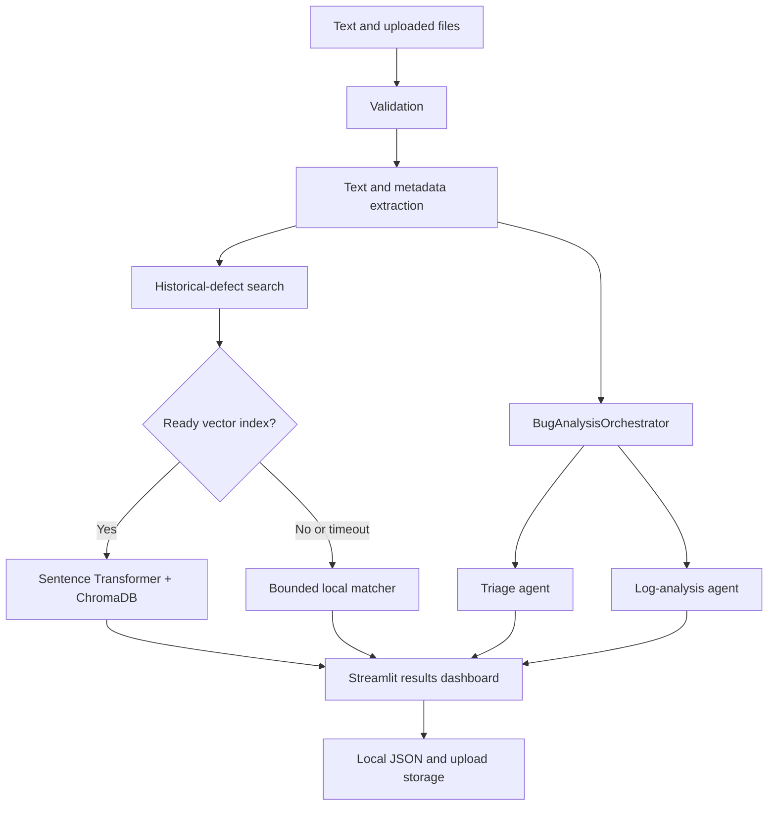

# System Architecture

The application is a local Streamlit system with deterministic analysis and
optional semantic retrieval.

## Design properties

- **Local-first:** no hosted API is required.
- **Fault-isolated:** one agent failure does not discard other results.
- **Bounded:** logs, stack frames, dataset rows, result counts, and vector-search
  time are limited.
- **Structured:** Pydantic models and stable metadata make results testable.
- **Graceful degradation:** semantic retrieval falls back to local matching.
- **Runtime separation:** reports, uploads, models, and vector indexes are not
  committed to Git.

The current implementation includes triage and log analysis. Duplicate
classification, synthesized root cause, and remediation agents remain planned.
