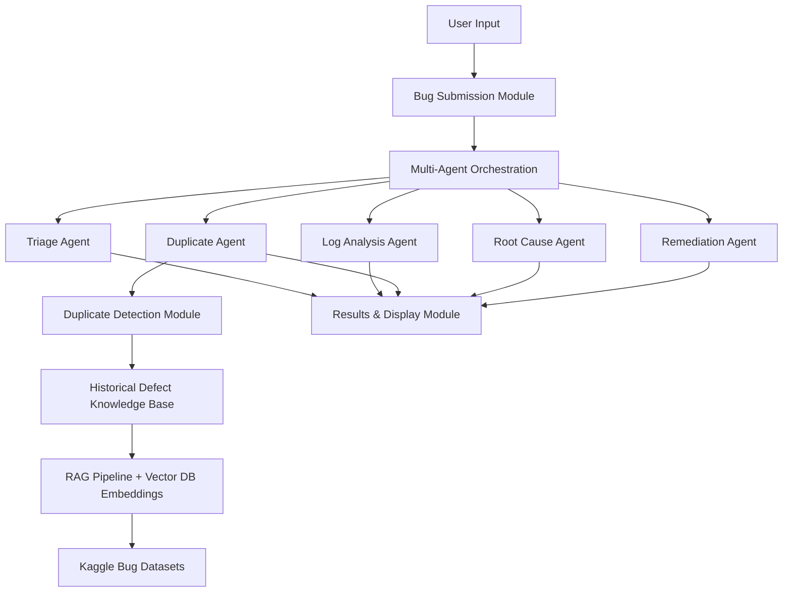

# System Architecture

This project starts with a bug report from the user. The report can include a plain description, stack trace, logs, uploaded files, and a screenshot.

After submission, the future system passes that information through a group of focused agents. Each agent looks at one part of the problem, then the app combines their findings into a clear result: likely root cause, duplicate status, and suggested fix.

For Milestone 1, the working part is the Bug Submission Module. The AI analysis, duplicate detection, and fix recommendation parts are planned as the next modules.
